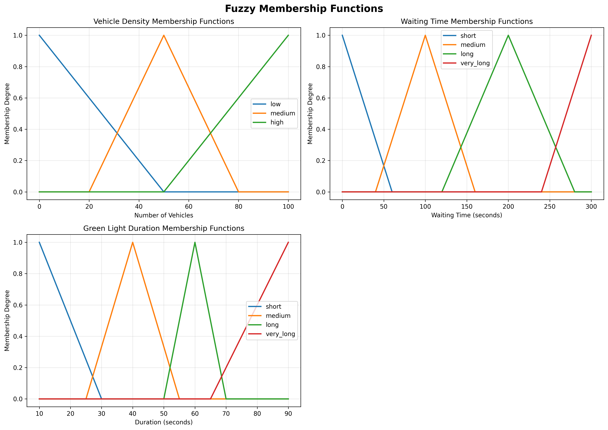

# 📚 Documentation & Assets

This folder contains documentation, diagrams, and generated visualizations for the Fuzzy Traffic Light Control System.

## 📊 Generated Visualizations

### Membership Functions



**File:** `membership_functions.png`

This visualization shows the fuzzy membership functions used in the traffic control system:

- **Top-left:** Vehicle Density membership functions (Low, Medium, High)
- **Top-right:** Waiting Time membership functions (Short, Medium, Long, Very Long)
- **Bottom-left:** Green Light Duration output functions (Short, Medium, Long, Very Long)

These membership functions define how crisp input values are converted to fuzzy linguistic terms.

## 🔄 Regenerating Visualizations

To regenerate the membership functions diagram:

```bash
poetry shell
python src/fuzzy_controller/membership_functions.py
```

The image will be saved to `docs/membership_functions.png`.

## 📁 Future Assets

Additional documentation assets can be placed here:

- System architecture diagrams
- Performance comparison charts
- Rule activation visualizations
- Traffic flow animations
- Simulation screenshots

## 🎨 Image Formats

All visualizations are saved as PNG files with:

- Resolution: 300 DPI
- Format: RGB
- Dimensions: Optimized for documentation

---

*Generated by Fuzzy Traffic Light Control System*
*Author: Luân B | SGU | 2025*
